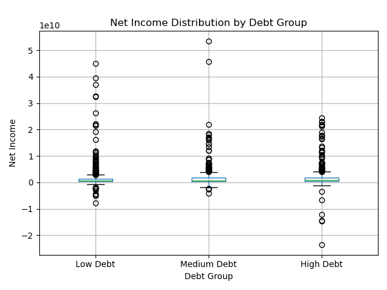

# NYSE Financial Analysis Project

Final Project for the SJS 2026 Coding Cohort

## Overview

This project analyzes financial statement data from companies listed on the New York Stock Exchange (NYSE) using the Kaggle NYSE Fundamentals dataset.

The goal is to inspect, clean, transform, and analyze financial data to investigate the relationship between corporate debt and profitability. The project applies exploratory data analysis (EDA), data cleaning techniques, statistical analysis, and visualization to determine whether companies with higher debt levels tend to generate greater profits.

---

## Research Question

**Is there a relationship between a company's debt level and its profit generation?**

---

## Key Findings

- Companies were grouped into Low Debt, Medium Debt, and High Debt categories using the Debt-to-Equity Ratio.
- High-debt companies showed slightly higher average net income than low-debt companies.
- Correlation between Debt-to-Equity Ratio and Net Income: **0.0146**
- Correlation between Debt-to-Equity Ratio and Profit Margin: **-0.0045**
- Results suggest that debt level alone is not a strong predictor of profitability.

---

## Dataset

**Source:** Kaggle NYSE Fundamentals Dataset

The dataset contains company-level financial statement data for firms listed on the New York Stock Exchange (NYSE), including:

- Total Assets
- Total Liabilities
- Total Equity
- Long-Term Debt
- Revenue
- Net Income
- Operating Income
- Profit Margin
- Cash Flow Metrics

### Dataset Summary

- **1,781** company-year records
- **448** companies
- **79** financial variables

---

## Methodology

### Data Inspection

The following inspection methods were used:

- `head()`
- `tail()`
- `info()`
- `describe()`
- `shape`
- `value_counts()`

### Data Cleaning

- Removed missing values using `dropna()`
- Removed duplicate records using `drop_duplicates()`
- Converted data types using `astype()`

### Data Transformation

- Created a Debt-to-Equity Ratio
- Renamed selected columns using `rename()`
- Sorted values using `sort_values()`
- Aggregated data using `groupby()`

### Data Analysis

- Correlation analysis
- Debt-group comparison
- Statistical summaries
- Financial data visualization

---

## Visualizations

The project generates the following visualizations:

1. Average Net Income by Debt Group
2. Debt-to-Equity Ratio vs Net Income
3. Debt-to-Equity Ratio vs Profit Margin
4. Net Income Distribution by Debt Group (Box Plot)

---

## Sample Visualizations

### Net Income Distribution by Debt Group



This box plot shows the distribution of company net income across low-, medium-, and high-debt groups.

---

## Project Structure

```text
NYSE-Project/
│
├── data/
│   ├── fundamentals.csv
│   └── securities.csv
│
├── code/
│   ├── inspect_nyse.py
│   └── NYSE_final.py
│
├── figures/
│   ├── average_net_income_by_debt_group.png
│   ├── debt_to_equity_vs_net_income.png
│   ├── debt_to_equity_vs_profit_margin.png
│   └── net_income_boxplot_by_debt_group.png
│
├── results/
│   ├── debt_profit_cleaned_data.csv
│   └── debt_profit_analysis.txt
│
├── others/
│   └── NYSE_Fundamentals_Report.txt
│
└── README.md
```

---

## Technologies Used

- Python
- Pandas
- Matplotlib
- NumPy
- Visual Studio Code

---

## Conclusion

Although companies with higher debt levels exhibited slightly higher average net income, the correlation analysis revealed an almost nonexistent relationship between debt and profitability. The findings suggest that debt level alone does not explain company profit generation and that other financial factors likely play a more significant role.

---

## Author

**Debasish Choudhury**  
SJS 2026 Coding Cohort
